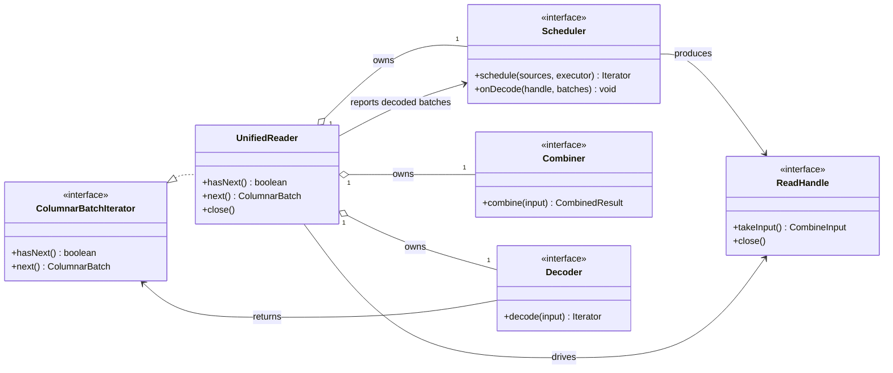
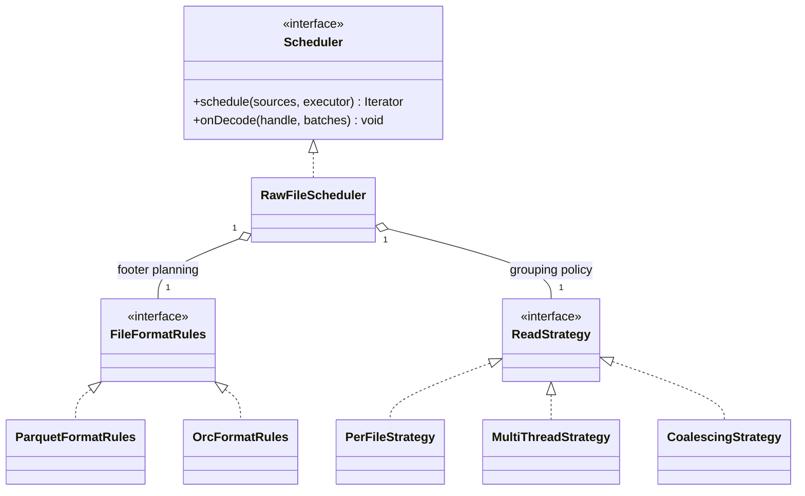
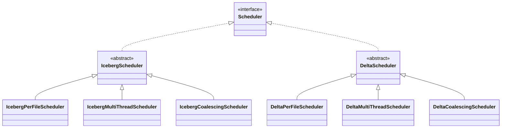
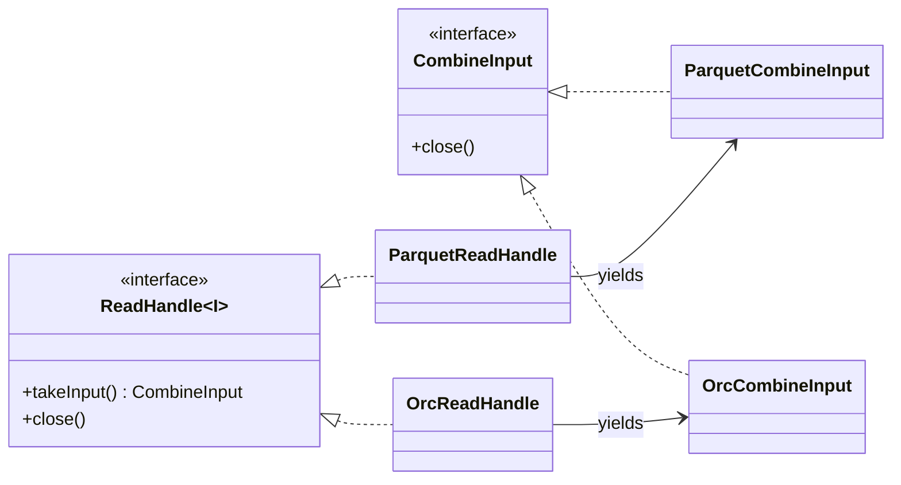
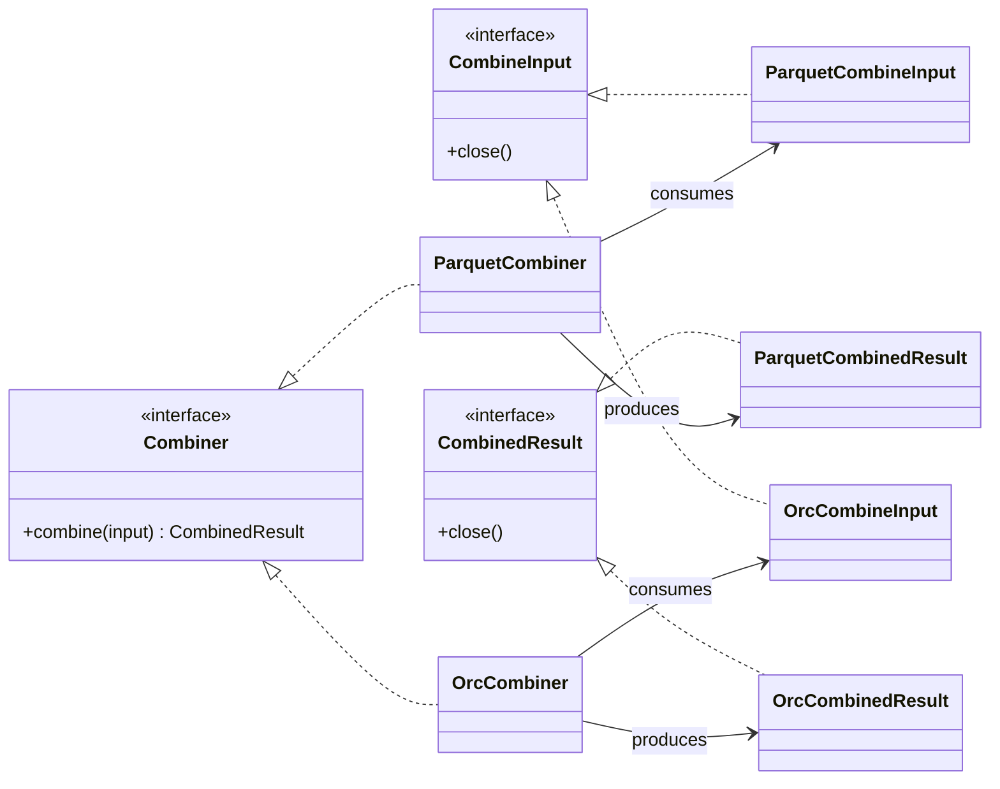
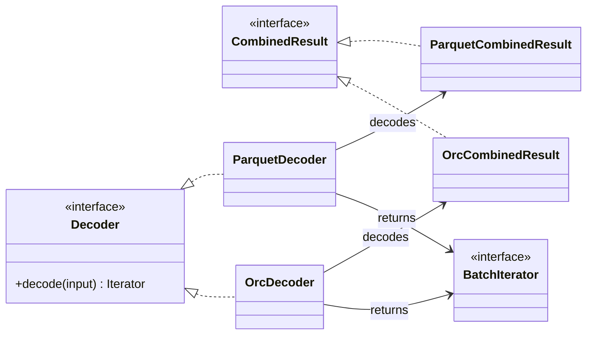
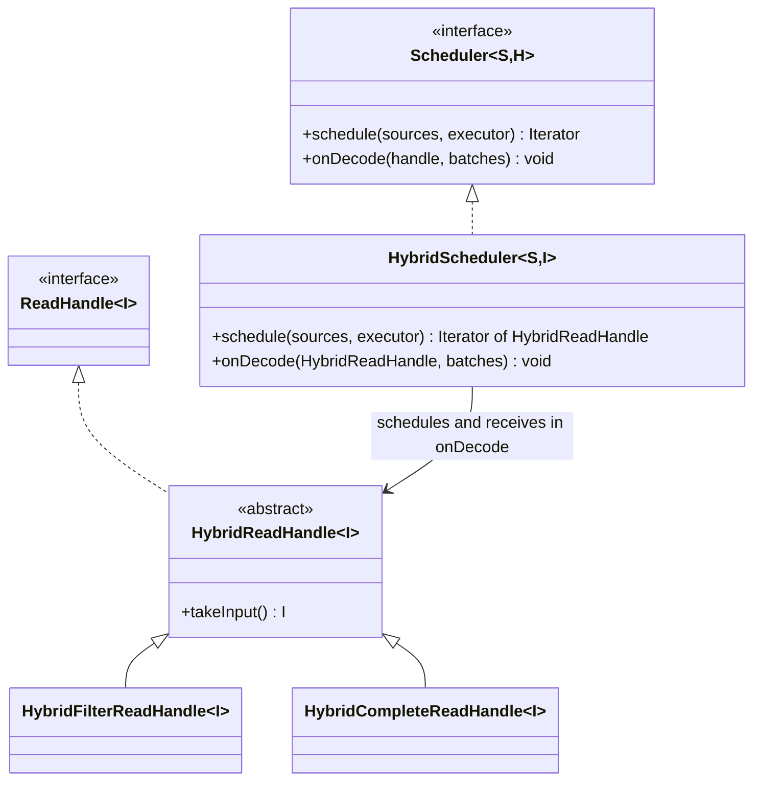
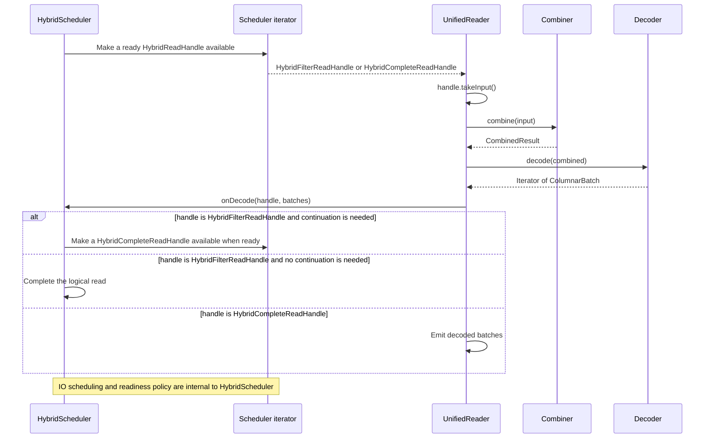

# Cudf-spark Unified Partition Reader Design

## 1. Background & Motivation

Spark RAPIDS currently maintains three kinds of partition readers — **per-file**,
**multi-threaded**, and **coalescing** — and re-implements each kind for every table format we
support: raw Parquet, Iceberg, and Delta Lake. Code is shared by inheriting from the raw Parquet
readers or embedding them as internal fields. Five problems fall out of this design.

### Problem 1: Combining behavior is difficult to customize

`com.nvidia.spark.rapids.parquet.MultiFileCloudParquetPartitionReader` exposes an overridable
function that determines whether two Parquet files can be combined. This works for simple
compatibility checks such as schema evolution. Modern table formats require richer rules based
on table metadata and scan context. For example, when equality deletes are present, only data
files with the same sequence number can be combined. Similarly, when a query projects the
`_spec` metadata column, files from different partition specs cannot be combined.

These rules are difficult to express cleanly in the current reader because the combination
decision happens after IO and is limited to whichever files complete at around the same time.
The reader submits one buffering job per file to a shared thread pool, and the Spark task thread
combines whichever buffers happen to be complete when it looks:

```
Spark task thread              Shared reader thread pool
─────────────────────────      ─────────────────────────────────────────────
submit one job per file ─────► file A: footer + filter ─► buffer whole file ─┐
                               file B: footer + filter ─► buffer whole file ─┤ completes in
                               file C: footer + filter ─► buffer whole file ─┘ arbitrary order
wait for next buffer    ◄──────────────────────────────────────────────────
combine? decided HERE,
from whichever buffers
happen to be ready
decode on GPU
```

The decision therefore depends on the randomness of IO completion: two compatible files that
finish far apart are decoded as two small batches. Conversely, table-format compatibility rules
must be forced into a raw-Parquet abstraction that does not have a complete view of the planned
scan. As the rules become more restrictive, fewer combinations survive arrival-order luck, and
small-file-heavy user environments degrade to per-file-sized GPU batches. This can cause serious
performance issues in production.

### Problem 2: The reader matrix is expensive to maintain

Three reader kinds times three table formats couples scheduling, IO, and decoding together in
nine variants connected by inheritance. Extending one table format's functionality means
navigating raw-Parquet internals it happens to inherit. What actually needs to be shared is much
narrower: the **scheduling logic**, the **file IO layer**, and the **file-format decoding**.

### Problem 3: IO and caching behavior are difficult to customize

The existing readers couple IO, caching, combination, and decoding. A table-format reader can
override a few hooks, but it cannot replace one of these policies independently. Modern table
formats need more control than raw Parquet decoding: applying deletes may require reading
additional files and retaining table-specific metadata or intermediate state. Supporting such
behavior currently requires inheriting from or embedding an entire Parquet reader and reaching
into its internal buffering and caching behavior.

### Problem 4: Table-format-specific behavior is difficult to customize

Iceberg currently handles schema evolution through a post-processor after the generic Parquet
decode. By that point, some file- and row-group-level information available during planning has
been discarded or must be carried through indirectly. Reconstructing constant-map values and row
positions therefore requires extra bookkeeping or materialization. The reader needs extension
points at the appropriate places in the pipeline so a table format can preserve and use this
information instead of recovering it after decode.

### Problem 5: The execution loop assumes that IO finishes before decoding starts

The existing readers materialize all selected columns before GPU decoding begins. A hybrid reader
can instead separate filter-column and payload-column work. When filter-column IO finishes,
payload IO starts immediately so it can overlap filter decoding. Once the scheduler evaluates the
decoded filter batches and identifies the surviving data, payload reads that are no longer needed
can be cancelled when possible, and completed data that is no longer needed can be discarded.

A read that does not use IO pruning follows the same protocol: its payload selection is known to
be all candidate data units, so payload IO starts immediately and the filter phase is a no-op.
Adding both cases to a reader whose control flow is fixed to `read -> decode` would either duplicate
the partition-reader loop or leak hybrid state transitions into the generic reader. Parquet is one
physical-format use of this protocol, not a constraint of the hybrid abstraction.

## 2. Goals

1. A new extensible framework for a unified partition reader.
2. Support one execution model for reads with and without filter-driven IO pruning, including
   speculative payload IO that overlaps filter decoding.
3. Let schedulers use file metadata to determine whether payload selection is initially known or
   requires filter decoding, and enforce file- and table-format compatibility before body IO.
4. Preserve bounded read-ahead and explicit host/device resource ownership.

## 3. Non-Goals

1. File-format-specific algorithms (Parquet/ORC decoding itself).
2. Table-format-specific algorithms (delete handling, schema evolution, etc.).
3. The rollout sequence, eligibility gates, and public configuration names for the initial hybrid
   reader implementation.

## 4. Design

The framework has one format-neutral coordinator, `UnifiedReader`, and three injected extension
points: `Scheduler`, `Combiner`, and `Decoder`. `UnifiedReader` controls the shared execution
service, implements `Iterator[ColumnarBatch]`, and owns the complete execution and cleanup loop.
File- and table-format implementations customize behavior by supplying different components and by
having the scheduler produce one or more `ReadHandle` values for each logical group of files. Each
handle represents one schedulable handoff and owns its logical-read context, resources, and
materialized input. The scheduler owns readiness, progression, and
cancellation. The combiner and decoder remain stateless data transformations, while `UnifiedReader`
only consumes ready handles, reports each decoded batch iterator back to the scheduler, and emits
any batches the scheduler did not consume.

### 4.1 `UnifiedReader`

Initialization asks the scheduler to schedule the complete source list. The Spark task thread
pulls one handle from the returned iterator, combines and decodes its input, then calls the
scheduler with the decoded batch iterator and original handle. The scheduler may arrange another
handoff and make a new handle available through the iterator, or complete the logical read. Any
batch iterator not consumed by the scheduler remains with `UnifiedReader`. The scheduler uses the
shared execution service for asynchronous IO, but it must not shut the service down. Combination
and decoding run synchronously on the Spark task thread.

The execution loop is:

```text
class UnifiedReader(sources, scheduler, combiner, decoder, executor):
  initialized = false
  closed = false
  handles = null
  currentHandle = null
  currentBatches = null

  initializeIfNeeded():
    if initialized:
      return
    initialized = true
    handles = scheduler.schedule(sources, executor)

  hasNext():
    if closed:
      return false

    try:
      initializeIfNeeded()
      while not closed:
        if currentBatches != null:
          if currentBatches.hasNext():
            return true
          close currentBatches if it is closeable
          currentBatches = null

        if not handles.hasNext():
          close()
          return false

        currentHandle = handles.next()
        input = currentHandle.takeInput()
        combined = combiner.combine(input)
        currentBatches = decoder.decode(combined)

        completedHandle = currentHandle
        currentHandle = null
        scheduler.onDecode(completedHandle, currentBatches)
    catch error:
      close()
      throw error

  next():
    try:
      if not hasNext():
        throw NoSuchElementException
      return currentBatches.next()
    catch error:
      close()
      throw error

  closeCurrent():
    close currentBatches if it is closeable
    currentBatches = null
    close currentHandle if it is not null
    currentHandle = null

  close():
    if not closed:
      closed = true
      closeCurrent()
      scheduler.close()
```

If an operation fails, `UnifiedReader` closes the current batch iterator, any handle that has
not been returned to the scheduler, and the scheduler before propagating the original error.
Ownership transfers on entry at each boundary: `ReadHandle.takeInput` transfers the handoff input to
`Combiner.combine`, and `Decoder.decode` consumes the combined result. Its returned batch iterator
owns the resources needed for decoding. `Scheduler.onDecode` consumes the original handle but
only borrows that iterator. It may drain filter batches, but `UnifiedReader` retains and eventually
closes the iterator. Each operation must close its inputs if it fails and either release or
transfer all retained resources if it succeeds. The scheduler owns all handles not currently
held by `UnifiedReader` and must cancel unfinished work when closed.

### 4.2 Extension points

The reader separates four responsibilities. A `Scheduler` groups the complete list of source files
and owns IO readiness and progression. A `ReadHandle` carries one scheduler handoff's logical-read
context and materialized input. A `Combiner` transforms that input into a decoder input. A `Decoder`
synchronously decodes it. `UnifiedReader` coordinates the handoffs without interpreting
file-format-specific phases or decoded results.

#### 4.2.1 `Scheduler`

```java
interface Scheduler<
    S extends ReadSource,
    H extends ReadHandle<?>> extends AutoCloseable {
  // Return an iterator that yields only handles whose input is ready to combine.
  Iterator<H> schedule(List<S> sources, ExecutorService executor);

  // Observe decoded batches with their original handle, creating a follow-up handle if needed.
  void onDecode(H handle, Iterator<ColumnarBatch> batches);
}
```

`schedule` is called once and returns an iterator over `ReadHandle` values. The scheduler performs
file-metadata work, applies file- and table-format compatibility rules, starts body IO, and
determines which handle is ready for combination and decoding. The iterator may wait for
asynchronous work when `hasNext` or `next` is called. It returns false only after every initial and
follow-up handle has completed and no ready handle remains.

After a handle's input is decoded, `UnifiedReader` calls `onDecode` with the decoded batch iterator
and the same handle yielded by the scheduler iterator. The method returns nothing: it is a
notification that gives the scheduler the completed handoff state needed to decide what to
schedule next. The scheduler implementation interprets the handle subtype and may consume the
decoded batches to create another handle. When no continuation is needed, it leaves the decoded
iterator untouched and `UnifiedReader` emits those batches after the callback returns. The
hybrid-specific transition is defined by `HybridScheduler` in Section 4.3.

For a hybrid read, `HybridScheduler` may choose either hybrid handle subtype as the first handle.
The selection criteria are scheduler policy and do not change the `UnifiedReader` loop.

The scheduler may admit files in source order or completion order. For raw files, per-file,
multi-threaded, and coalescing behavior can be injected as `ReadStrategy` implementations. Iceberg
and Delta Lake require concrete schedulers for each strategy because scheduling must coordinate
table-specific state such as deletes, sequence numbers, and metadata columns. Because a scheduler
may own asynchronous callbacks and metadata resources, its inherited `AutoCloseable.close` contract
must cancel unfinished work and release retained resources. Closing it must also unblock a task
thread waiting on the handle iterator.

#### 4.2.2 `ReadHandle`

```java
interface CombineInput extends AutoCloseable {}

interface ReadHandle<I extends CombineInput> extends AutoCloseable {
  // Transfer the materialized input for this scheduler handoff.
  I takeInput();
}
```

`ReadHandle` describes one schedulable reader handoff. Its concrete type retains whatever source,
format, table, and resource context its scheduler needs when `onDecode` is called. It does not
expose scheduler decisions to `UnifiedReader`.

The scheduler yields a handle only after attaching its materialized `CombineInput`.
`takeInput` transfers the input out of the handle exactly once, while the handle itself remains
alive so `UnifiedReader` can return it with the decoded batch iterator. The scheduler yields a given
handle once. If another handoff is required, it transfers the relevant context into a new handle.
Closing a handle cancels or releases any requests, buffers, and intermediate state still associated
with it.

#### 4.2.3 `Combiner`

```java
interface Combiner<
    I extends CombineInput,
    C extends CombinedResult> {
  // Combine one materialized input synchronously on the Spark task thread.
  C combine(I input);
}
```

The combiner is a stateless transformation and has no knowledge of scheduler state, filter results,
why its input was produced, or whether another scheduler handoff follows. It combines the
already-read buffers described by `CombineInput` into an owned `CombinedResult`, either by building
a synthetic file-format input or by creating a logical multi-source input. It may allocate output
buffers, but it does not initiate unrelated IO or retain state between calls. Combination consumes
host memory and CPU, so `combine` runs synchronously on the Spark task thread rather than on the
shared IO executor. Calling `combine` transfers ownership of the input to the combiner on entry; on
failure it must release the input and every resource allocated for the attempt.

#### 4.2.4 `Decoder`

```java
interface Decoder<C extends CombinedResult> {
  // Decode one combined input without deciding how the batches will be used.
  Iterator<ColumnarBatch> decode(C input) throws Exception;
}
```

The decoder is a stateless transformation. It decodes the columns described by the concrete
`CombinedResult` and always returns the same kind of batch iterator. It has no scheduler reference,
does not inspect the `ReadHandle`, and does not decide whether the batches are filter data, final
output, or whether another scheduler handoff is needed. `Scheduler.onDecode` interprets the original
`ReadHandle`; the decoder is not passed that handle. For a hybrid read, `HybridScheduler` may drain
batches decoded from a `HybridFilterReadHandle` to derive a filter selection and create a
`HybridCompleteReadHandle`. If the scheduler leaves the iterator untouched, `UnifiedReader` emits
the batches.

Table-format transformations such as schema evolution, metadata columns, row positions, and delete
application are described by context carried through the handles and combined results. This
allows one Parquet decoder to serve raw Parquet, Iceberg, and Delta Lake, while one ORC decoder
serves raw ORC. Calling `decode` transfers ownership of the combined input to the decoder on entry.
The returned iterator owns the combined input, decoded columns, and other data that must remain
valid while the batches are consumed. On failure, the decoder must close the combined input and
every resource allocated for the attempt.

These interfaces allow one concern to change without replacing the others:

| Replace | Behavior customized |
| --- | --- |
| `Scheduler` | metadata/body IO, readiness, continuation, cancellation, admission, and grouping |
| `ReadHandle` | logical-read context, table context, request handles, and combine input |
| `Combiner` | physical versus logical combination and output-buffer construction |
| `Decoder` | Parquet/ORC decoding and data post-processing |

#### 4.2.5 Implementation class hierarchies

The class hierarchy is split by component so that each diagram shows one extension point and its
immediate collaborators. Dashed inheritance arrows denote interface implementation; aggregation
edges denote constructor-injected components.

##### Core reader

`UnifiedReader` depends on the three injected component interfaces and drives the handles produced
by the scheduler:



##### Scheduler

The raw-file and table-format scheduler hierarchies are shown separately. Inputs and read-handle
types are omitted because they do not affect the scheduler inheritance structure.

###### Raw-file scheduler

Raw-file scheduling composes file-format rules with a reusable read strategy:



###### Table-format schedulers

Iceberg and Delta Lake encode each scheduling strategy in a concrete table-specific class. These
schedulers provide table-specific Parquet footer processing and planning because Parquet is
currently the only physical format supported by either table integration:



##### Read handle

The physical file format supplies the ordinary handle implementation and its combine-input type.
The hybrid handle hierarchy is shown with the rest of the hybrid design in Section 4.3.



##### Combiner

The physical file format selects one of two stateless combiner implementations:



##### Decoder

The decoder hierarchy also has only one implementation per physical file format:



Concrete readers select their scheduler, combine-input type, combiner, and decoder independently.
These component combinations are passed to `UnifiedReader`; they are not subclasses of it. The
hybrid specialization is described in Section 4.3.

### 4.3 Hybrid reader integration

The hybrid reader composes `HybridScheduler` and two concrete `HybridReadHandle` subtypes with the
ordinary combiner and decoder for the selected physical format. A `HybridFilterReadHandle` carries
input for decoding the filter columns. A `HybridCompleteReadHandle` carries input for a complete
decode, whether it is the initial handle or a continuation created after filter decoding. Only
`HybridScheduler` interprets these subtypes. There is no `HybridCombiner` or `HybridDecoder`; both
handle types transfer ordinary `CombineInput` values into the same file-format components.

#### 4.3.1 Class hierarchy

The class hierarchy below highlights only the hybrid specialization. `HybridScheduler` implements
the format-neutral `Scheduler` contract, and `HybridReadHandle<I>` implements `ReadHandle<I>`. Its
two concrete subclasses identify the handoff being reported to `onDecode`. A reader binds `I` to
its physical-format `CombineInput` type.



The hierarchy is independent of Parquet and ORC. For example, a Parquet reader binds `I` to
`ParquetCombineInput`. Another physical format can bind its own `CombineInput` type without
changing the hybrid classes.

#### 4.3.2 Runtime interaction



`UnifiedReader` does not inspect the hybrid subtype. It runs the same synchronous combine/decode
path for either handle and reports the decoded iterator with the original handle. When
`HybridScheduler.onDecode` receives a `HybridFilterReadHandle`, it may consume the filter result
and make a `HybridCompleteReadHandle` available through the existing scheduler iterator. When it
receives a `HybridCompleteReadHandle`, it leaves the output iterator for `UnifiedReader` to emit.
The one-step case starts with a `HybridCompleteReadHandle` and uses the same framework path.

The framework deliberately does not specify when `HybridScheduler` issues filter or non-filter IO,
whether it performs speculative reads, how it cancels or discards work, how it groups files, or
which metadata controls its choices. Those decisions are scheduler implementation details. The
only framework contract is that the scheduler iterator yields a handle when its `CombineInput` is
ready and that `onDecode` may add a follow-up handle to that same iterator.

Both hybrid handle subtypes yield the ordinary `CombineInput` type selected for the physical
format. Consequently, the concrete combiner and decoder remain file-format components and do not
contain hybrid continuation logic. The scheduler can change its IO or coalescing implementation
without changing the format-neutral `UnifiedReader` loop or those component interfaces. For
Parquet, the binding is `ParquetCombineInput`, `ParquetCombiner`, and `ParquetDecoder`.

### 4.4 Scheduler readiness and resource bounds

The scheduler owns admission, asynchronous IO, and its internal ready queue. The iterator returned
by `schedule` exposes only handles whose `CombineInput` is ready. The scheduler is responsible for
bounding the work and resources it owns, but the framework does not prescribe its admission unit,
byte-accounting method, IO ordering, or ready-queue ordering.

Ownership of a ready handle transfers from the scheduler to `UnifiedReader` when the iterator
yields it. `takeInput` transfers the handoff input to the combiner, while `UnifiedReader` retains
the handle. Ownership of the handle transfers back to the scheduler when `onDecode` is called, while
the decoded batch iterator is borrowed for the duration of the callback. A scheduler may consume
the batches and transfer retained state into another handle, or leave the iterator untouched for
`UnifiedReader` to consume. `UnifiedReader` retains ownership of the iterator and closes it when it
is exhausted or on failure. Any IO cancellation, semaphore use, retained filter state, and resource
accounting remain inside the scheduler implementation.

Closing the scheduler stops handle admission, unblocks iterator waiters, and releases every handle
and internal resource it owns. `UnifiedReader` closes a handle that fails before it can be handed
back through `onDecode`. Consequently, scheduler implementations share the same framework cleanup
boundary even when their IO strategies differ.

### 4.5 Iceberg Parquet example

As one concrete physical-format binding, an Iceberg Parquet reader injects its components directly
into `UnifiedReader`:

```java
UnifiedReader<
    IcebergPartitionedFile,
    HybridReadHandle<ParquetCombineInput>,
    ParquetCombineInput,
    ParquetCombinedResult> reader =
    new UnifiedReader<>(
        sources,
        hybridScheduler,
        new ParquetCombiner(),
        new ParquetDecoder(constantsProvider),
        executor);
```

The responsibilities are divided as follows:

- `hybridScheduler` is a `HybridScheduler` configured with the Iceberg-specific metadata and
  grouping policies required by this scan. It implements the `Scheduler` contract, creates the two
  hybrid handle subtypes, and owns any transition performed by `onDecode`. Its internal IO strategy
  is not part of the `UnifiedReader` contract.
- Each `HybridReadHandle<ParquetCombineInput>` carries the ready input and whatever context the
  scheduler needs when the handle is returned through `onDecode`. It exposes none of the
  scheduler's transition decisions to `UnifiedReader`.
- `ParquetCombiner` combines one `ParquetCombineInput` into a synthetic or logical multi-source
  `ParquetCombinedResult` without receiving a `HybridReadHandle` or retaining state between calls.
- `ParquetDecoder` decodes each `ParquetCombinedResult` and applies the carried Iceberg context for
  constant values, row positions, schema evolution, and deletes. It never receives a
  `HybridReadHandle` and does not decide what follows.

Other table combinations replace only the scheduler configuration or implementation. They can use
the same `ParquetCombiner` and `ParquetDecoder` because the hybrid transition remains behind the
`Scheduler` interface. Raw ORC can compose its own scheduler with `OrcCombiner` and `OrcDecoder`;
its scheduler yields `OrcReadHandle` values directly. Each combination uses the same scheduler
iterator and resource-lifecycle rules in `UnifiedReader`.
