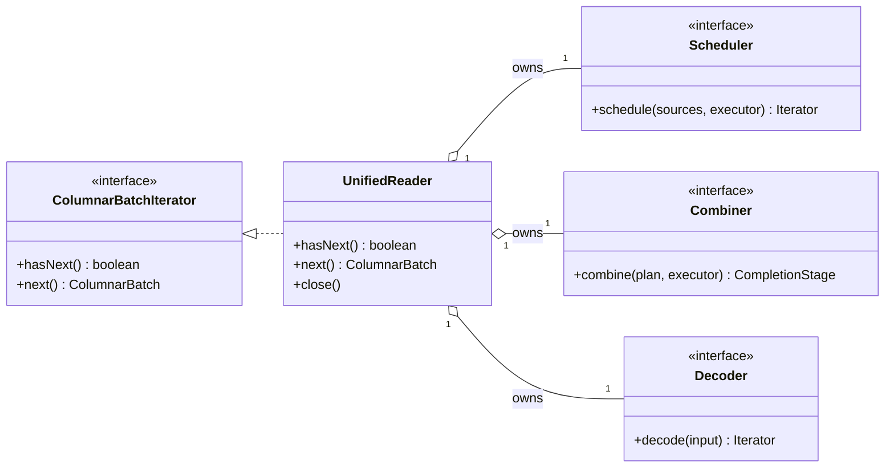
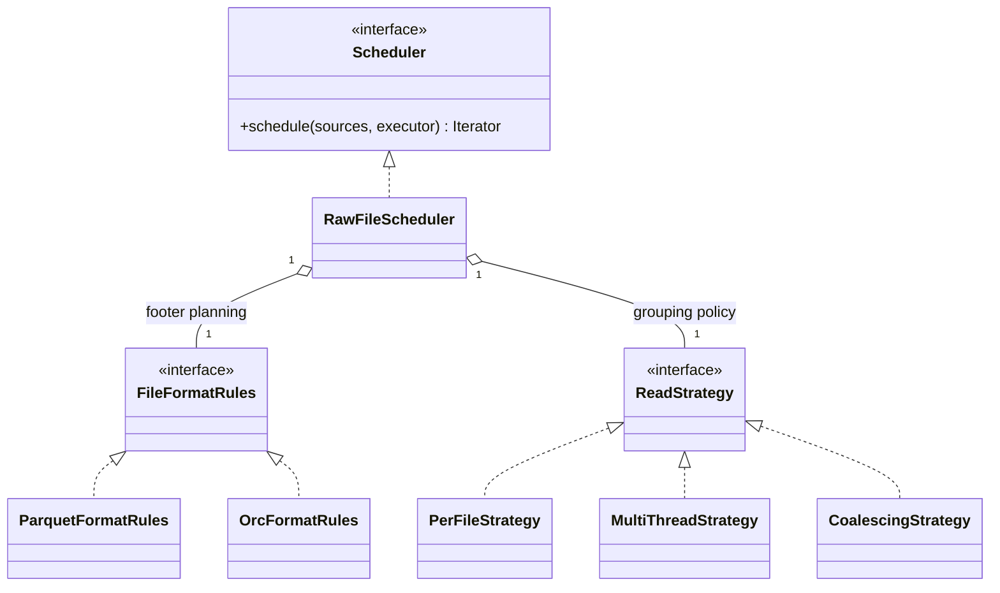
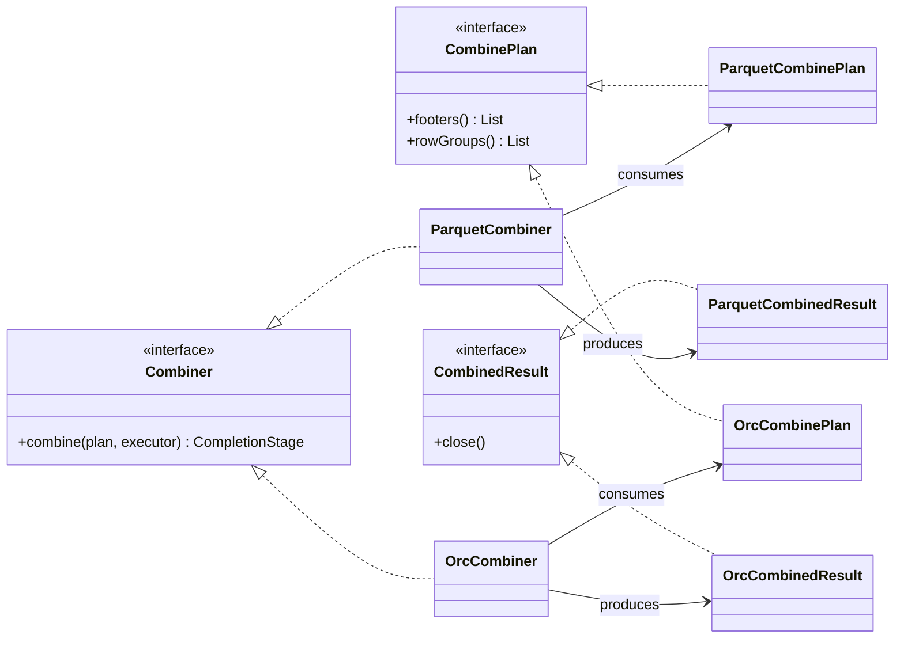
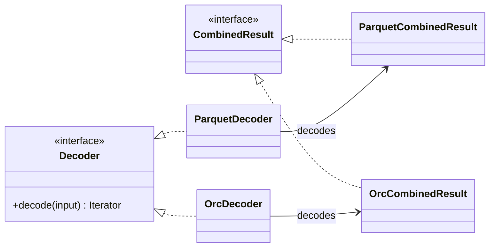

# Cudf-spark Unified Partition Reader Design

## 1. Background & Motivation

Spark RAPIDS currently maintains three kinds of partition readers — **per-file**,
**multi-threaded**, and **coalescing** — and re-implements each kind for every table format we
support: raw Parquet, Iceberg, and Delta Lake. Code is shared by inheriting from the raw Parquet
readers or embedding them as internal fields. Four problems fall out of this design.

### Problem 1: Combining behavior is difficult to customize

`com.nvidia.spark.rapids.parquet.MultiFileCloudParquetPartitionReader` exposes an overridable
function that determines whether two Parquet files can be combined. This works for simple
compatibility checks such as schema evolution. Modern table formats require richer rules based
on table metadata and scan context. For example, when equality deletes are present, only data
files with the same sequence number can be combined. Similarly, when a query projects the
`_spec` metadata column, files from different partition specs cannot be combined.

These rules are difficult to express cleanly in the current reader because the combination
decision happens after IO and is limited to whichever files complete at around the same time.
The reader submits one buffering job per file to a shared thread pool, and the Spark task thread
combines whichever buffers happen to be complete when it looks:

```
Spark task thread              Shared reader thread pool
─────────────────────────      ─────────────────────────────────────────────
submit one job per file ─────► file A: footer + filter ─► buffer whole file ─┐
                               file B: footer + filter ─► buffer whole file ─┤ completes in
                               file C: footer + filter ─► buffer whole file ─┘ arbitrary order
wait for next buffer    ◄──────────────────────────────────────────────────
combine? decided HERE,
from whichever buffers
happen to be ready
decode on GPU
```

The decision therefore depends on the randomness of IO completion: two compatible files that
finish far apart are decoded as two small batches. Conversely, table-format compatibility rules
must be forced into a raw-Parquet abstraction that does not have a complete view of the planned
scan. As the rules become more restrictive, fewer combinations survive arrival-order luck, and
small-file-heavy user environments degrade to per-file-sized GPU batches. This can cause serious
performance issues in production.

### Problem 2: The reader matrix is expensive to maintain

Three reader kinds times three table formats couples scheduling, IO, and decoding together in
nine variants connected by inheritance. Extending one table format's functionality means
navigating raw-Parquet internals it happens to inherit. What actually needs to be shared is much
narrower: the **scheduling logic**, the **file IO layer**, and the **file-format decoding**.

### Problem 3: IO and caching behavior are difficult to customize

The existing readers couple IO, caching, combination, and decoding. A table-format reader can
override a few hooks, but it cannot replace one of these policies independently. Modern table
formats need more control than raw Parquet decoding: applying deletes may require reading
additional files and retaining table-specific metadata or intermediate state. Supporting such
behavior currently requires inheriting from or embedding an entire Parquet reader and reaching
into its internal buffering and caching behavior.

### Problem 4: Table-format-specific behavior is difficult to customize

Iceberg currently handles schema evolution through a post-processor after the generic Parquet
decode. By that point, some file- and row-group-level information available during planning has
been discarded or must be carried through indirectly. Reconstructing constant-map values and row
positions therefore requires extra bookkeeping or materialization. The reader needs extension
points at the appropriate places in the pipeline so a table format can preserve and use this
information instead of recovering it after decode.

## 2. Goals

1. A new extensible framework for a unified partition reader.
2. Explore the design space of each component.

## 3. Non-Goals

1. File-format-specific algorithms (Parquet/ORC decoding itself).
2. Table-format-specific algorithms (delete handling, schema evolution, etc.).

## 4. Design

The framework has one format-neutral coordinator, `UnifiedReader`, and three injected extension
points: `Scheduler`, `Combiner`, and `Decoder`. `UnifiedReader` controls the shared execution
service, implements `Iterator[ColumnarBatch]`, and owns the complete execution and cleanup loop.
File- and table-format implementations customize behavior by supplying different components.

### 4.1 `UnifiedReader`

Initialization asks the scheduler to schedule the complete source list. The Spark task thread
pulls one combine plan from the returned iterator, waits for the combiner to materialize it, and
passes the combined input to the decoder. The execution service is shared with the injected
components, but they must not shut it down.

The execution loop is:

```text
class UnifiedReader(sources, scheduler, combiner, decoder, executor):
  initialized = false
  closed = false
  plans = null
  currentInput = null
  currentBatches = null

  initializeIfNeeded():
    if initialized:
      return
    initialized = true
    plans = scheduler.schedule(sources, executor)

  hasNext():
    if closed:
      return false

    try:
      initializeIfNeeded()
      while not closed:
        if currentBatches != null and currentBatches.hasNext():
          return true

        closeCurrent()
        if not plans.hasNext():
          close()
          return false

        plan = plans.next()
        currentInput = await(combiner.combine(plan, executor))
        currentBatches = decoder.decode(currentInput)
    catch error:
      close()
      throw error

  next():
    if not hasNext():
      throw NoSuchElementException
    return currentBatches.next()

  closeCurrent():
    close currentBatches if it is closeable
    close currentInput
    currentBatches = null
    currentInput = null

  close():
    if not closed:
      closed = true
      closeCurrent()
      scheduler.close()
```

If an operation fails, `UnifiedReader` closes the current decoded iterator and combined input,
then closes the scheduler before propagating the original error. A successful combined input is
owned by `UnifiedReader` until its decoded iterator is exhausted. The scheduler owns unfinished
footer work and must cancel it when closed.

### 4.2 Extension points

The reader separates three kinds of customization. A `Scheduler` schedules the complete list of
source files and produces combine plans. A `Combiner` performs the body IO and materializes one
plan as a decoder input. A `Decoder` synchronously converts that input to GPU batches and applies
any table-format post-processing. `UnifiedReader` coordinates the handoff between them.

#### 4.2.1 `Scheduler`

```java
interface CombinePlan<F, R> {
  List<F> footers();
  List<R> rowGroups();
}

interface Scheduler<
    S extends ReadSource,
    P extends CombinePlan<?, ?>> extends AutoCloseable {
  // Schedule the complete input set and return plans in the selected output order.
  Iterator<P> schedule(List<S> sources, ExecutorService executor);
}
```

`schedule` is called once and returns an iterator over `CombinePlan` values. A combine plan
typically contains the filtered footers and row groups that should be read and combined together.
It is metadata-only; body data is read later by the combiner. The iterator may wait for asynchronous
footer operations when `hasNext` or `next` is called, and it ends after every source has been
scheduled and any remaining plan has been emitted.

The scheduler may admit files in source order or completion order. For raw files, per-file,
multi-threaded, and coalescing behavior can be injected as `ReadStrategy` implementations. Iceberg
and Delta Lake require concrete schedulers for each strategy because scheduling must coordinate
table-specific state such as deletes, sequence numbers, and metadata columns. Because a scheduler
may own asynchronous callbacks and footer resources, its inherited `AutoCloseable.close` contract
must cancel unfinished work and release retained resources. Closing it must also unblock a task
thread waiting on the plan iterator.

#### 4.2.2 `Combiner`

```java
interface Combiner<P extends CombinePlan<?, ?>, C extends CombinedResult> {
  // Materialize one closed plan on the shared execution service.
  CompletionStage<C> combine(P plan, ExecutorService executor);
}
```

The combiner uses the plan's footers and row groups to perform body IO, apply the cache policy,
allocate output buffers, and perform physical or logical combination. It returns an owned
`CombinedResult` ready for decoding. On exceptional completion, it must release every resource
allocated for that attempt.

#### 4.2.3 `Decoder`

```java
interface Decoder<C extends CombinedResult> {
  // Decode and post-process one combined input on the Spark task thread.
  Iterator<ColumnarBatch> decode(C input) throws Exception;
}
```

The decoder owns file-format decoding. Table-format transformations such as schema evolution,
metadata columns, row positions, and delete application are described by context carried from the
combine plan into the combined result. This allows one Parquet decoder to serve raw Parquet,
Iceberg, and Delta Lake, while one ORC decoder serves raw ORC. The decoder does not close the
input. It remains valid while the returned iterator is consumed, and `UnifiedReader` closes it
after that iterator is exhausted or when an error occurs.

These interfaces allow one concern to change without replacing the others:

| Replace | Behavior customized |
| --- | --- |
| `Scheduler` | table-specific scheduling, file-format planning, admission order, and grouping |
| `Combiner` | body IO, caching, logical versus copying combination, and output buffers |
| `Decoder` | Parquet or ORC decoding and plan-driven post-processing |

#### 4.2.4 Implementation class hierarchies

The class hierarchy is split by component so that each diagram shows one extension point and its
immediate collaborators. Dashed inheritance arrows denote interface implementation; aggregation
edges denote constructor-injected components.

##### Core reader

`UnifiedReader` depends only on the three extension-point interfaces:



##### Scheduler

The raw-file and table-format scheduler hierarchies are shown separately. Inputs and combine-plan
types are omitted because they do not affect the scheduler inheritance structure.

###### Raw-file scheduler

Raw-file scheduling composes file-format rules with a reusable read strategy:



###### Table-format schedulers

Iceberg and Delta Lake encode each scheduling strategy in a concrete table-specific class. These
schedulers directly implement Parquet footer processing and planning because Parquet is currently
the only physical format supported by either table integration:


##### Combiner

The physical file format selects one of two combiner implementations:



##### Decoder

The decoder hierarchy also has only one implementation per physical file format:



Raw files select Parquet or ORC scheduler rules, combiner, and decoder. Iceberg and Delta Lake
currently use Parquet and select a table-specific scheduler class for the required strategy. That
scheduler carries table context into `ParquetCombinePlan` and `ParquetCombinedResult`. These
component combinations are passed to `UnifiedReader`; they are not subclasses of it.

### 4.3 Iceberg Parquet example

An Iceberg Parquet reader injects its concrete components directly into `UnifiedReader`:

```java
UnifiedReader<
    IcebergPartitionedFile,
    ParquetCombinePlan,
    ParquetCombinedResult> reader =
    new UnifiedReader<>(
        sources,
        new IcebergMultiThreadScheduler(
            icebergFileIO,
            cachePolicy,
            expectedSchema,
            deleteLoader,
            maxBatchRows,
            maxBatchBytes,
            combineThreshold),
        new ParquetCombiner(icebergFileIO, cachePolicy),
        new ParquetDecoder(constantsProvider),
        executor);
```

The responsibilities are divided as follows:

- `IcebergMultiThreadScheduler` loads and filters Parquet footers, creates `ParquetCombinePlan`
  metadata, and owns Iceberg sequence-number, partition-spec, schema-evolution, delete, and
  completion-order scheduling semantics. It can be replaced with `IcebergPerFileScheduler` or
  `IcebergCoalescingScheduler`.
- `ParquetCombiner` uses Iceberg `FileIO` and the configured cache and output-buffer policies to
  read the planned row groups and build a synthetic Parquet input. These policies can select a
  contiguous or file-backed buffer without introducing another combiner variant.
- `ParquetDecoder` performs the GPU Parquet decode and applies the plan-driven Iceberg processing
  carried by `ParquetCombinedResult`, including constant values, row positions, schema evolution,
  and deletes.

Other table combinations replace only the table scheduler strategy. For example, Delta Lake
coalescing uses `DeltaCoalescingScheduler`, `ParquetCombiner`, and `ParquetDecoder`. Raw ORC can
still compose `RawFileScheduler`, `OrcFormatRules`, and any `ReadStrategy`, followed by
`OrcCombiner` and `OrcDecoder`. The `UnifiedReader` execution and resource-lifecycle rules remain
unchanged.
